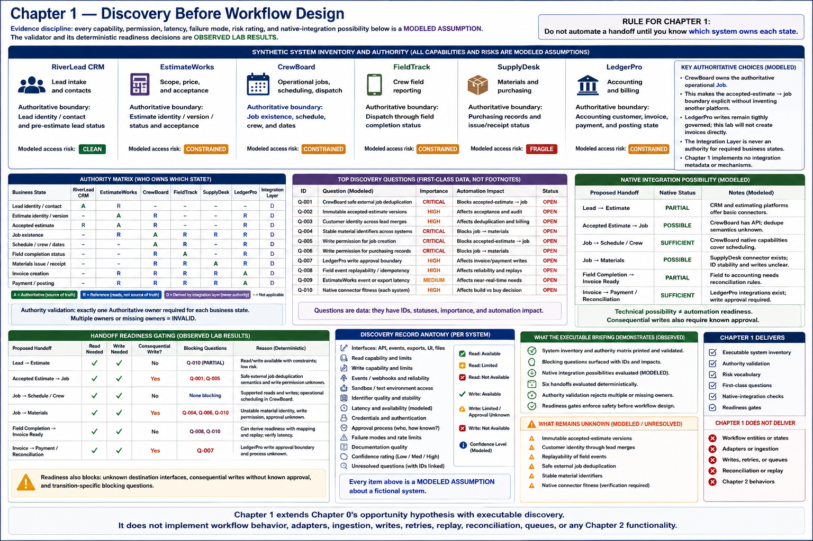

# Chapter 1 — Discovery Before Workflow Design



> **Evidence discipline:** every capability, permission, latency, failure mode,
> risk rating, and native-integration possibility below is a **MODELED
> ASSUMPTION** about a fictional system. The validator and its deterministic
> readiness decisions are **OBSERVED LAB RESULTS**.

## A diagram is not discovery

A workflow arrow says that information moves; it does not say which side owns
truth, whether identifiers survive edits, whether a write is permitted, or who
must approve it. Automating that arrow first can create competing records. The
rule for this chapter is therefore: **do not automate a handoff until you know
which system owns each state.** Chapter 1 creates discovery records and makes
unsafe gaps executable; it creates no adapters or workflow behavior.

## Synthetic system inventory and authority

| System | Purpose | Authoritative boundary | Modeled access risk |
|---|---|---|---|
| RiverLead CRM | Lead intake and contacts | Lead identity/contact and pre-estimate lead status | CLEAN |
| EstimateWorks | Scope, price, and acceptance | Estimate identity/version/status and acceptance | CONSTRAINED |
| CrewBoard | Operational jobs, scheduling, dispatch | **Job existence**, schedule, crew, and dates | CONSTRAINED |
| FieldTrack | Crew field reporting | Dispatch through field completion status | CONSTRAINED |
| SupplyDesk | Materials and purchasing | Purchasing records and issue/receipt status | FRAGILE |
| LedgerPro | Accounting and billing | Accounting customer, invoice, payment, and posting state | CONSTRAINED |

CrewBoard deliberately owns the authoritative operational Job. This makes the
future accepted-estimate → job boundary explicit without inventing another
platform. LedgerPro writes remain tightly governed, and this lab will not create
invoices directly.

The executable authority matrix distinguishes authoritative, reference,
derived-integration, and not-applicable roles. The Integration Layer is never
an authority for the required business states. It may eventually own only
integration metadata, but Chapter 1 implements none of that metadata or its
mechanisms.

## Access uncertainty and build versus buy

Each discovery record exposes read/write capability, interfaces, events,
exports, sandbox access, identifier quality and stability, documentation,
latency, credentials, approval knowledge, failures, confidence, and unresolved
questions. Questions are data with IDs, statuses, importance, and automation
impact—not footnotes.

Every proposed handoff also records a native-integration status. `PARTIAL`,
`POSSIBLE`, or `SUFFICIENT` is not proof that a connector works; it forces a
build-versus-buy check before custom code. Technical possibility is weaker than
automation readiness: consequential writes additionally require established
write access and a understood approval boundary.

## What the executable briefing demonstrates

Run:

```bash
python -m trades_lab chapter1
```

The briefing inventories systems, prints blocking questions, surfaces native
alternatives, and evaluates six future handoffs deterministically. Baseline
`accepted estimate → job` is **BLOCKED** because CrewBoard's safe external
job-deduplication semantics remain a blocking question. `job → materials` is
also blocked by unstable material identity, write permission, and unknown
approval. By contrast, low-risk `lead → estimate` is
**READY_WITH_CONSTRAINTS**, not unconditionally ready.

Authority validation rejects both multiple owners and missing owners. Readiness
also blocks unknown destination interfaces, consequential writes without known
approval, and transition-specific blocking questions. These behaviors are
**OBSERVED LAB RESULTS**. They show discovery can change what the team is
willing to build; they do not validate any fictional vendor claim.

## What remains unknown

Open discovery includes immutable accepted-estimate versions, customer identity
through lead merges, replayability of field events, safe external job
deduplication, and stable material identifiers. Native connector fitness also
requires verification. These remain **MODELED ASSUMPTIONS / unresolved modeled
questions**.

Chapter 1 adds an executable system inventory, authority validation, risk
vocabulary, first-class questions, native-integration checks, and readiness
gates to Chapter 0's opportunity hypothesis. It does **not** implement workflow
entities, state machines, adapters, ingestion, writes, retries, replay,
reconciliation, queues, or any Chapter 2 behavior.
