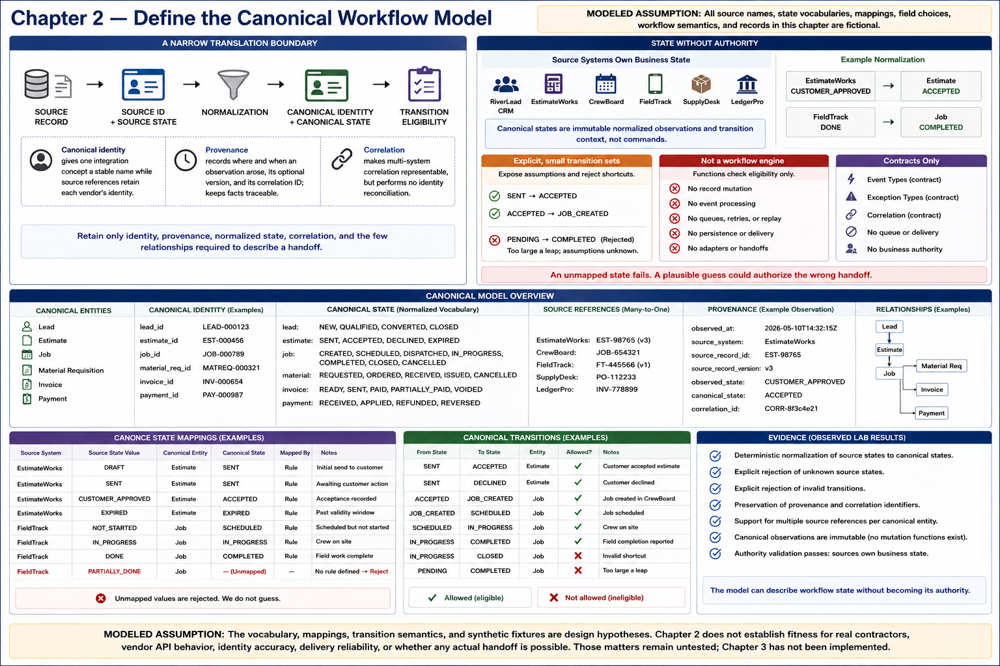

# Chapter 2 — Define the Canonical Workflow Model



> **MODELED ASSUMPTION:** All source names, state vocabularies, mappings, field
> choices, workflow semantics, and records in this chapter are fictional.

## A narrow translation boundary

Copying each source schema wholesale would couple the integration to irrelevant
vendor details and quietly create another system of record. Instead, the canonical
model retains only identity, provenance, normalized state, correlation, and the
few relationships required to describe a handoff.

```text
SOURCE RECORD
     ↓
SOURCE ID + SOURCE STATE
     ↓
NORMALIZATION
     ↓
CANONICAL IDENTITY + CANONICAL STATE
     ↓
TRANSITION ELIGIBILITY
```

Canonical identity gives one integration concept a stable name while source
references retain each vendor's identity. It makes multi-system correlation
representable, but performs no identity reconciliation. Provenance records where
and when an observation arose, its optional version, and its correlation ID; this
keeps normalized facts traceable.

## State without authority

**Source systems own business state.** Canonical states are immutable normalized
observations and transition context, not commands. EstimateWorks
`CUSTOMER_APPROVED` maps to estimate `ACCEPTED`; FieldTrack `DONE` maps to job
`COMPLETED`. An unmapped value fails rather than being guessed, because a plausible
guess could authorize the wrong handoff.

Explicit, small transition sets expose assumptions such as `SENT → ACCEPTED` and
reject shortcuts such as `PENDING → COMPLETED`. The functions check eligibility;
they neither mutate records nor process events. This is deliberately not a generic
workflow engine. Event and exception types are contracts only: there is no queue,
delivery, retry, replay, persistence, adapter, or handoff behavior.

## Evidence and limits

**OBSERVED LAB RESULT:** Executable tests demonstrate deterministic normalization,
explicit rejection of unknown states and invalid transitions, preservation of
provenance and multiple source references, and immutable canonical observations.
The model can describe workflow state without becoming its authority.

**MODELED ASSUMPTION:** The vocabulary, mappings, transition semantics, and
synthetic fixtures are design hypotheses. Chapter 2 does not establish fitness for
real contractors, vendor API behavior, identity accuracy, delivery reliability,
or whether any actual handoff is possible. Those matters remain untested; Chapter
3 has not been implemented.
