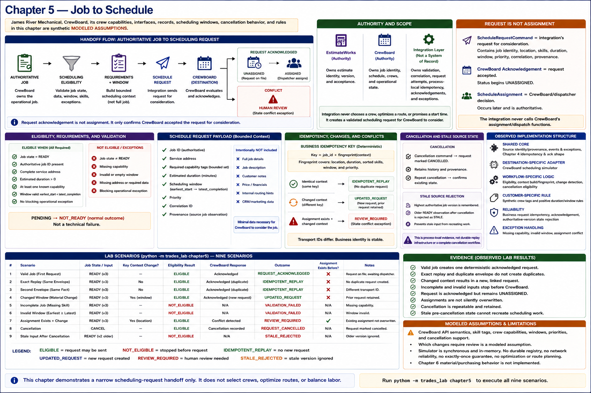

# Chapter 5 — Job to Schedule



> James River Mechanical, CrewBoard, its crew capabilities, interfaces, records,
> scheduling windows, cancellation behavior, and rules in this chapter are synthetic
> **MODELED ASSUMPTIONS**.

The question is deliberately narrower than “how should this job be scheduled?” Once
an authoritative operational job exists, the integration can validate and transfer
the context needed for CrewBoard to consider it. It cannot choose a crew, optimize a
route, balance labor, or promise a start time.

```text
AUTHORITATIVE JOB
       ↓
SCHEDULING ELIGIBILITY
       ↓
REQUIREMENTS + WINDOW
       ↓
SCHEDULE REQUEST
       ↓
CREWBOARD
       ↓
       ├── REQUEST ACKNOWLEDGED
       │        ↓
       │     UNASSIGNED
       │        ↓
       │     ASSIGNED
       │
       └── CONFLICT
                ↓
          HUMAN REVIEW
```

## Request is not assignment

`ScheduleRequestCommand` is the integration's narrow statement that a validated job
is ready for consideration. It carries job identity, service location, bounded skill
requirements, duration, window, priority, correlation, and provenance—not the whole
job. `ScheduleAssignment` is an authoritative CrewBoard/dispatcher decision. Request
acknowledgement therefore begins as `UNASSIGNED`; it does not mean fully scheduled.
The simulator's `record_assignment` exists only to preload or simulate destination
behavior, and the integration never calls it.

## Eligibility and bounded requirements

A job must be `READY`, have authoritative identity, a complete service address,
positive estimated duration, at least one known capability, a window whose earliest
start precedes latest completion, and no blocking operational exception. `PENDING`
is a normal `NOT_READY` outcome rather than a technical failure. Missing capability
or an invalid window creates a controlled validation exception: the integration does
not guess. The small skill vocabulary and these policies are customer-specific
**MODELED ASSUMPTIONS**, not a general workforce ontology.

## Replay, changed context, and rescheduling boundary

A deterministic fingerprint covers scheduling-relevant identity, duration, sorted
skills, window, location, and priority. The business idempotency key combines that
fingerprint with the authoritative job ID. Identical delivery resolves to the same
CrewBoard request. A material change produces a new, explicitly linked
`UPDATED_REQUEST` and retains the preceding request as provenance; it never moves or
assigns a crew. This is intentionally a small fingerprint, not generic versioning.

If an assignment already exists, changed context produces `REVIEW_REQUIRED`, a
state-conflict exception, and review events. The existing assignment is neither
overwritten nor supplemented with a new request. Whether every modeled change should
require review is a **MODELED ASSUMPTION** owned by this experiment.

## Cancellation and stale source state

The narrow cancellation notification marks retained requests `CANCELLED`; it does
not delete scheduling evidence. Repeating it confirms the existing cancellation.
The coordinator remembers the highest authoritative job version and rejects an older
`READY` observation after cancellation, so stale input cannot recreate work. This is
process-local deterministic evidence, not durable replay infrastructure or a complete
cancellation workflow.

## What actually reused from Chapter 4?

- Shared immutable provenance, correlation, event, and exception contracts reused.
- `IdempotencyStatus`, the stable business-key structure, and acknowledgement pattern
  reused cleanly.
- CrewBoard request storage, scheduling-context fingerprinting, cancellation, changed-
  context handling, and authoritative-assignment conflict rules remained specialized.

The result is mixed rather than forced: foundational reliability shapes repeat, but
destination conflict semantics do not become universal. This is evidence relevant to
the original 52.8% reusable-core hypothesis; it is not yet a measured percentage.

## Observed implementation structure

| Classification | Chapter 5 implementation |
|---|---|
| **SHARED CORE** | source identity/provenance, correlation, event/exception contracts, Chapter 4 idempotency status and acknowledgement shape |
| **DESTINATION-SPECIFIC ADAPTER** | bounded CrewBoard scheduling simulator |
| **WORKFLOW-SPECIFIC LOGIC** | eligibility, context construction/fingerprint, change detection, cancellation eligibility |
| **CUSTOMER-SPECIFIC RULE** | synthetic crew tags and positive-duration/window policies |
| **RELIABILITY** | business request idempotency, acknowledgement, authoritative-version stale rejection |
| **EXCEPTION HANDLING** | missing capability, invalid window, assignment conflict |

## Evidence gained

Within the executable synthetic model, these are **OBSERVED LAB RESULTS**: a valid
job produces one deterministic acknowledged request; exact replay produces no
duplicate; changed context differs from replay; incomplete and invalid jobs stop;
requirements cross without crew selection; acknowledgement remains distinct from
assignment; assignments are not silently overwritten; cancellation is repeatable;
and stale pre-cancellation state cannot recreate scheduling work.

CrewBoard's API semantics, skill tags, crew capabilities, windows, priorities,
cancellation support, and which changes demand review remain **MODELED ASSUMPTIONS**.
There is no claim of external-vendor feasibility, durable exactly-once processing,
schedule quality, optimization, routing, employee ranking, or labor balancing.

Run the deterministic scenarios with:

```bash
python -m trades_lab chapter5
```

Chapter 6 material/purchasing behavior is not implemented.
