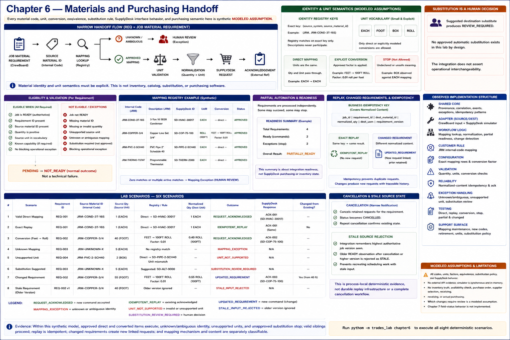

# Chapter 6 — Materials and Purchasing Handoff



> Every material code, unit, conversion, equivalence, substitution rule, SupplyDesk
> interface behavior, and purchasing semantic here is synthetic **MODELED ASSUMPTION**.

Material identity is harder than carrying a job ID: two systems can name the same
modeled physical thing differently, and a matching product identity is still unsafe
when quantity units disagree. This experiment asks whether job requirements can cross
a bounded boundary without creating inventory, catalog, purchasing, ERP, or
substitution software.

```text
JOB MATERIAL REQUIREMENT
        ↓
SOURCE MATERIAL ID
        ↓
MAPPING LOOKUP
        ↓
        ├── UNKNOWN / AMBIGUOUS
        │          ↓
        │     HUMAN REVIEW
        │
        └── APPROVED MAPPING
                   ↓
             UNIT VALIDATION
                   ↓
             NORMALIZATION
                   ↓
           SUPPLYDESK REQUEST
                   ↓
            ACKNOWLEDGEMENT
```

## Explicit identity and unit semantics

The registry uses exact `(source system, source material ID)` keys. For example,
James River Mechanical's internal `JRM-COND-3T-16S` explicitly maps to modeled
SupplyDesk ID `SD-HVAC-30017`; descriptions never participate in lookup. One active,
approved candidate proceeds. Zero candidates or multiple candidates create a
`MAPPING` exception, with no closest-match behavior.

The deliberately small unit vocabulary is `EACH`, `FOOT`, `BOX`, and `ROLL`. Direct
mappings preserve quantity and unit. A modeled copper-line mapping alone may apply
the inspectable `FEET-TO-100FT-ROLL` factor. A `BOX` observation against an `EACH`
mapping stops because the lab has no approved box-size rule. This is deterministic
normalization, not dimensional analysis, and does not establish real product
equivalence or conversion correctness.

## Substitution is a human decision

A suggested destination substitute produces `REVIEW_REQUIRED` and
`MATERIAL_SUBSTITUTION_REVIEW_REQUIRED`. Even though the original material maps, the
integration does not assert operational interchangeability. No approved automatic
substitution fixture exists, by design; there is no recommendation engine.

## Partial automation and readiness

Requirements are processed independently. In the four-item fixture, a direct item
and explicitly converted item proceed while unknown identity and unsupported units
become controlled exceptions. The integration summary is `PARTIALLY_READY` (two
ready, two exceptions). This summary is not SupplyDesk purchasing or inventory state,
and unresolved requirements remain visible rather than being discarded.

## Replay and changed requirements

The idempotency key covers job, requirement ID, normalized destination material,
quantity, unit, and requirement version. Exact replay resolves the existing
SupplyDesk reference and creates no duplicate. Changing 40 feet to 55 feet generates
an `UPDATED_REQUIREMENT`, a distinct command linked to the retained previous request.
Both commands retain source provenance. This modeled destination behavior avoids an
unrelated silent second request; a real destination might instead require review.

## Reusable mechanism versus mapping content

What actually reused from Chapters 4 and 5: immutable provenance, correlation,
events, exception contracts, stable business-key thinking, narrow commands, and
authoritative acknowledgements. What did not reuse: material IDs, unit vocabulary,
conversion factors, substitution policy, the SupplyDesk adapter, and James River
Mechanical's internal codes. The exact lookup/normalization mechanism is reusable
code; the registry entries are customer/source-specific configuration.

| Classification | Observed implementation structure |
|---|---|
| **SHARED CORE** | provenance, correlation, events, exceptions, idempotency and acknowledgement patterns |
| **SOURCE-SPECIFIC ADAPTER** | modeled CrewBoard material input and bounded SupplyDesk simulator |
| **WORKFLOW-SPECIFIC LOGIC** | mapping lookup, normalization, partial readiness, changed-requirement linking |
| **CUSTOMER-SPECIFIC RULE** | James River Mechanical internal-code mapping |
| **CONFIGURATION** | exact mapping rows and explicit conversion factor |
| **VALIDATION** | positive quantity, source-unit and conversion checks |
| **RELIABILITY** | normalized-content idempotency and authoritative acknowledgement |
| **EXCEPTION HANDLING** | unknown/ambiguous mappings, unsupported units, substitution review |
| **TESTING** | direct, replay, conversion, stop, partial and changed scenarios |
| **SUPPORT SURFACE** | destination retirement, new internal codes, changed units or substitution policy |

Mappings can become stale. A retired SupplyDesk record, a newly introduced customer
code, or changed unit/substitution policy requires mapping maintenance. Chapter 6
only identifies this support surface; it adds no monitoring or maintenance automation.

## Restaurant-lab structural comparison

The earlier restaurant experiment suggested that product/inventory identity can
create source-specific mapping work. This different domain repeats four executable
structures: identifier mapping, explicit unit semantics, unknown-mapping exceptions,
and customer-specific configuration. That is a structural comparison—not a claim
that restaurant inventory and mechanical materials are equivalent.

## Evidence and limitations

**OBSERVED LAB RESULTS:** approved direct mappings and explicit conversions execute
deterministically; unknown and ambiguous identity, unsupported units, and unapproved
substitution stop; valid sibling requirements proceed; replay is idempotent; changes
differ from replay while prior provenance remains; and mapping mechanism and content
are separately classifiable. This strengthens the hypothesis that reliability
mechanisms repeat, but weakens any broad claim that most integration content repeats:
material semantics add conspicuous customer-specific configuration and support
surface.

**MODELED ASSUMPTIONS:** all codes, units, factors, equivalence, substitution policy,
SupplyDesk behavior, changed-request semantics, and purchasing meaning. There is no
external API evidence, durable storage, inventory truth, availability check, purchase
order, supplier selection, receiving, or actual purchasing.

Run all deterministic scenarios with:

```bash
python -m trades_lab chapter6
```

Chapter 7 field-status behavior is not implemented.
