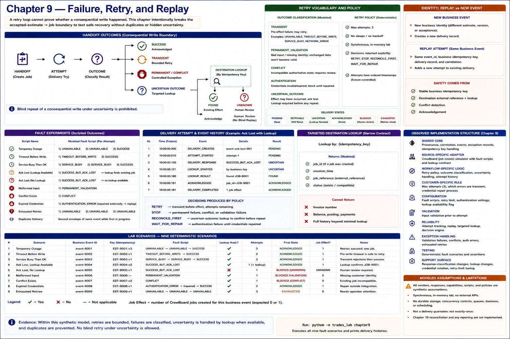

# Chapter 9 — Failure, Retry, and Replay



## Question and boundary

A retry loop cannot prove whether a consequential write happened. This chapter deliberately breaks the accepted-estimate → job boundary to ask whether a bounded integration can recover without duplicating a job, hiding uncertainty, or retrying permanent faults forever. The implementation is a synchronous, in-memory fault laboratory—not a production message platform. It wraps a selected create rather than rewriting Chapters 4–8 or implementing Chapter 10's general reconciliation process.

```text
HANDOFF
   ↓
ATTEMPT
   ↓
   ├── SUCCESS
   │      ↓
   │ ACKNOWLEDGED
   │
   ├── TRANSIENT FAILURE
   │      ↓
   │ BOUNDED RETRY
   │
   ├── PERMANENT / CONFLICT
   │      ↓
   │ EXCEPTION
   │
   └── UNCERTAIN OUTCOME
          ↓
    DESTINATION LOOKUP
          ↓
       ┌──┴──┐
       ↓     ↓
    FOUND   UNKNOWN
       ↓     ↓
    ACK     HUMAN REVIEW
```

## Explicit vocabulary and policy

`TRANSIENT` means the modeled failure occurred before a confirmed effect: unavailable, timeout-before-write, network-like failure, or `SERVICE_BUSY`. It may retry. `PERMANENT_VALIDATION` means the event is malformed or lacks required identity; unchanged bad data does not become good on attempt three. `CONFLICT` means authoritative destination state is incompatible and requires review rather than overwrite. `AUTHENTICATION` blocks automatic attempts until modeled credential repair. `UNCERTAIN_OUTCOME` means the write may have succeeded but its acknowledgement was lost; another create is unsafe until targeted lookup proves the effect.

The deterministic policy permits at most three attempts, performs no sleep, and returns an explicit `RETRY`, `STOP`, `RECONCILE_FIRST`, or `WAIT_FOR_REPAIR` decision. Attempt timestamps begin at a fixture-controlled instant. States are `PENDING`, `RETRYABLE`, `ACKNOWLEDGED`, `BLOCKED`, `UNCERTAIN`, and `EXHAUSTED`.

## Experiments

- **Temporary outage:** `UNAVAILABLE → UNAVAILABLE → SUCCESS` produces three attempts, one job effect, and `ACKNOWLEDGED`.
- **Timeout before write / temporary rejection:** these clean pre-write transient failures safely retry to one effect when the script eventually succeeds.
- **Acknowledgement lost:** the destination creates `JOB-9001`, the delivery records `UNCERTAIN`, and no second create is sent. Lookup by the original idempotency key confirms `JOB-9001`, producing acknowledgement with one effect.
- **No lookup:** the same uncertain write cannot be proven. Blind replay remains prohibited; the delivery is `BLOCKED` with human review required. Destination interface quality therefore changes recoverability.
- **Malformed input and conflict:** each makes one attempt, creates a controlled exception, and stops. Conflict never overwrites destination state.
- **Expired credentials:** authentication blocks further writes. A synthetic repair plus explicit replay adds an attempt to the same logical business event and can succeed.
- **Exhaustion:** three persistent transient failures become `EXHAUSTED`; unresolved work remains visible.
- **Duplicate delivery:** a second transport envelope joins the existing logical delivery by business idempotency identity rather than creating parallel work.

Events make the path inspectable: attempt start, transient failure, retry scheduled, uncertainty, targeted lookup, existing-effect confirmation, acknowledgement, authentication block, conflict/exception, and retry exhaustion. Correlation remains constant while each attempt receives its own identifier.

## Retry, replay, and identity

A **new business event** changes business identity. A **replay attempt** retains the original event ID, business idempotency key, delivery record, and correlation and appends an attempt. Retry safety comes from Chapter 4's stable business key, destination external reference/lookup, conflict detection, and acknowledgement—not from iteration itself. Chapter 9's lookup is narrowly triggered for one uncertain delivery; it is not a report, scheduled audit, or cross-system mismatch inventory.

## Reuse inspection

Genuinely reusable shapes now include business idempotency-key handling, acknowledgements, correlation, controlled exception records, deterministic attempt/event history, and the explicit retry-decision function. A narrow destination lookup contract is reusable only where the interface actually supports stable external-reference lookup.

Destination-specific work remains substantial: vendor response classification, which responses are transient, lookup capability, conflict compatibility rules, authentication behavior, and acknowledgement semantics. Workflow-specific logic still determines whether a write is consequential and therefore unsafe to repeat under uncertainty.

## Implementation-structure evidence

The inventory expands **RELIABILITY** (bounded policy, attempts, replay, targeted lookup), **EXCEPTION HANDLING** (validation, conflict, authentication, uncertainty), **TESTING** (fault scripts), and **SUPPORT SURFACE**. It also records reused **SHARED CORE**, destination-facing **SOURCE-SPECIFIC ADAPTER**, **WORKFLOW-SPECIFIC LOGIC**, **VALIDATION**, and **CONFIGURATION**. Repository structure and test coverage are not converted into human-hour claims.

## Support surface

Reliability creates operational burden: exhausted work needs attention; uncertain outcomes need reconciliation; credentials need repair; replay needs audit; conflict exceptions accumulate; vendor response semantics can change; and retry limits may need tuning. These are **SUPPORT SURFACE**, relevant to the recurring-fee hypothesis, but this chapter does not calculate support economics.

## Evidence and limitations

### OBSERVED LAB RESULT

Within the executable synthetic model, transient failures retry deterministically and stop at the limit; malformed and conflicting inputs do not retry; authentication blocks until modeled repair; uncertainty differs from confirmed failure; stable lookup confirms an accepted effect without duplication; no-lookup uncertainty remains visible; and replay preserves business identity and correlation.

### MODELED ASSUMPTION

Fault types, destination behavior, the three-attempt limit, authentication/repair semantics, stable lookup capability, response classifications, and outage scripts are fictional. Process-local memory does not prove durability, concurrency safety, real vendor behavior, or production-grade reliability.

No queue, daemon, dead-letter system, dashboard, generic workflow engine, scheduled audit, fleet-wide comparison, or Chapter 10 reconciliation has been implemented.
