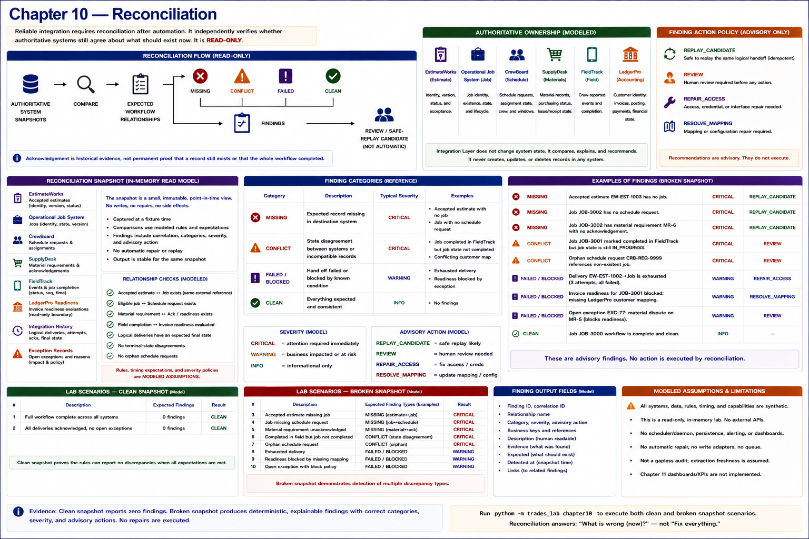

# Chapter 10 — Reconciliation



**Reliable integration requires reconciliation after automation.** Retry attempts one known delivery; replay attempts the same logical handoff while preserving business identity; reconciliation independently asks whether authoritative systems agree about what should exist now. An acknowledgement is historical evidence, not permanent proof that a record still exists or that the wider workflow completed.

```text
AUTHORITATIVE SYSTEM SNAPSHOTS
        ↓
      COMPARE
        ↓
EXPECTED WORKFLOW RELATIONSHIPS
        ↓
   ┌────┼────────┬─────────┐
   ↓    ↓        ↓         ↓
MISSING CONFLICT FAILED   CLEAN
        ↓        ↓
      FINDINGS
        ↓
REVIEW / SAFE-REPLAY CANDIDATE
```

## Read-oriented implementation

`ReconciliationSnapshot` is a small immutable in-memory view of EstimateWorks, the authoritative job system, CrewBoard, SupplyDesk, FieldTrack, the LedgerPro readiness boundary, logical delivery history, and exception records. `Reconciler` compares accepted estimate ↔ job, eligible job ↔ schedule request, material requirement ↔ acknowledgement/readiness, and field completion ↔ invoice-readiness relationships. It also identifies unresolved logical deliveries and exceptions, terminal-state disagreements, and orphan schedule requests. A requested but `UNASSIGNED` schedule is healthy unless the modeled stage says assignment is already expected.

Findings use bounded category, severity, and advisory-action vocabularies. Missing accepted-estimate jobs, missing required handoffs, exhausted/uncertain deliveries, state conflicts, and orphans are critical in this fixture. Unresolved mapping and explicit readiness blockers are warnings; unsupported informational exceptions are informational. A completed job with prerequisites but no evaluation is a missing handoff, while a readiness record blocked by missing accounting mapping is an explained blocker. These rules, timing expectations, snapshots, and action policy are **MODELED ASSUMPTIONS**.

Recommendations (`REPLAY_CANDIDATE`, `REVIEW`, `REPAIR_ACCESS`, or `RESOLVE_MAPPING`) do not execute. Reconciliation answers **what is wrong**, not **fix everything**. Authority may be unclear, intent ambiguous, and destination changes consequential. There is no write adapter, automatic repair, daemon, assignment queue, or exception-resolution workflow.

## Clean and broken evidence

The clean fixture has one complete workflow and no findings. The compact broken fixture includes a missing job, missing schedule, absent material acknowledgement, unresolved material identity, an explained invoice blocker, exhausted delivery, open exception, cross-system state disagreement, and orphan request. The logical delivery check uses final delivery state, so an earlier transient failure followed by acknowledgement is not reported.

This is an **OBSERVED LAB RESULT**: within deterministic synthetic snapshots, the code detects those discrepancies, preserves correlation, produces stable output, distinguishes a clean workflow, and performs zero repairs. It does not prove real vendor access, real-world data quality, correct production authority, or adequate polling/timing rules.

## Identity, provenance, and implementation structure

Earlier artifacts made comparison possible: Chapter 4 stable estimate external references; Chapter 5 job and schedule-request identity; Chapter 6 requirement, mapping, idempotency, and request identity; Chapter 7 authoritative job mapping, source event, sequence, and correlation; Chapter 8 job identity and readiness fingerprint; and Chapter 9 logical delivery state and correlation. The experiment found no need to change those earlier contracts. The smallest gap was a chapter-specific snapshot projection connecting them; it is intentionally not a new database or generic data-quality platform.

Classification:

- **SHARED CORE:** authoritative references, canonical states, correlation, history, and exception records.
- **WORKFLOW-SPECIFIC LOGIC:** estimate/job, job/schedule, material/readiness, and completion/invoice expectations.
- **RELIABILITY:** interpretation of final logical delivery state rather than counting attempts.
- **SUPPORT SURFACE:** recurring runs, repeated mismatch review, stale configuration, access/mapping repair, replay decisions, and operational follow-up.

## Support burden and limitations

Reliable integration creates recurring obligations: run reconciliation, inspect findings, resolve access and mapping problems, replay proven-safe cases, and coordinate human review. These are **SUPPORT SURFACE**, even though users may not perceive them as features; recurring revenue is therefore not pure contribution. No Chapter 18 economics are calculated.

The lab has fixture time rather than freshness policy, process-local snapshots rather than extraction, and no scheduler, persistence, alerting, management KPI dashboard, automatic repair, or human-resolution machinery. Chapter 11 remains unimplemented.
