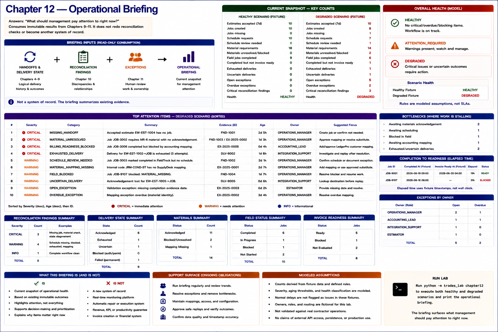

# Chapter 12 — Operational Briefing



The operational briefing answers **what should management pay attention to right now?** Reconciliation instead asks whether systems and handoffs are consistent. The exception workflow asks what human-review work exists and who owns it. The briefing consumes their immutable results; it does not reproduce reconciliation checks or become another truth store.

```text
HANDOFFS + DELIVERY STATE
          +
RECONCILIATION FINDINGS
          +
EXCEPTIONS
          ↓
OPERATIONAL BRIEFING
          ↓
   ┌──────┼───────────┐
   ↓      ↓           ↓
BOTTLENECKS FAILURES OWNERSHIP
          ↓
MANAGEMENT ATTENTION

NOT A NEW SYSTEM OF RECORD
```

## Compact current snapshot

The two fixture-controlled scenarios derive counts for estimate-to-job gaps, scheduling review, unresolved/blocked materials, blocked field work, completed-but-not-ready jobs, exhausted/uncertain delivery, open/overdue exceptions, and reconciliation findings. The degraded fixture surfaces one missing estimate handoff, one schedule review, two material mappings, one field block, one billing-readiness block, one exhausted and one uncertain delivery, five open/two overdue exceptions, and three critical reconciliation findings.

Attention items use only `INFO`, `WARNING`, and `CRITICAL`, then sort severity first, age second, and stable ID last. Each retains a reconciliation or exception ID. Exception-backed items also retain Chapter 11's owner role; for example the accounting mapping blocker remains owned by `ACCOUNTING_LEAD`. IDs provide bounded drill-down in code without an interactive dashboard.

## Timing and health

Completion-to-readiness durations use the fixture `generated_at`, never wall-clock time. `JOB-9001` takes 19 hours to become ready. `JOB-9107` has remained blocked for 31 hours and has no invented readiness timestamp.

**MODELED ASSUMPTION:** no critical/overdue/blocking evidence is `HEALTHY`; actionable warnings are `ATTENTION_REQUIRED`; an uncertain write or critical reconciliation finding is `DEGRADED`. Severity, priority, selected measures, aging, and normal-delay interpretation are also modeled. These are not validated contractor KPIs or an industry SLA. An explainable category is preferable to a pseudo-precise numeric score.

## Reuse and implementation structure

The snapshot reuses Chapter 4 estimate/job identity, Chapter 5 schedule state, Chapter 6 material state, Chapter 7 field state, Chapter 8 readiness blockers, Chapter 9 logical delivery state, the already-produced Chapter 10 report, and Chapter 11 exception ownership/aging. Shared identity, correlation, timestamps, severity, and evidence references are **SHARED CORE**. Bottleneck aggregation and completion delay are new **WORKFLOW-SPECIFIC LOGIC**. Health thresholds, ordering, and inclusion are **CONFIGURATION**; healthy/degraded fixtures and aggregation assertions are **TESTING**.

Management visibility is itself a **SUPPORT SURFACE**: new states need treatment, new exception types need classification, owners and priorities change, thresholds need maintenance, and stale aggregation reduces trust.

## Evidence, economics, and limits

**OBSERVED LAB RESULT:** counts and elapsed time derive deterministically; findings retain provenance; overdue work retains owners; explicit rules explain classification; existing evidence supports a compact view without a second system of record.

This does not validate real management KPIs, measure human hours, build trends, or create production monitoring. It creates no invoice, and **invoice principal is not software-created value**. It claims only visibility into elapsed time and unresolved prerequisites. There is no web dashboard, BI store, reporting API, scheduler, alerting, or Chapter 13 deployment work.
