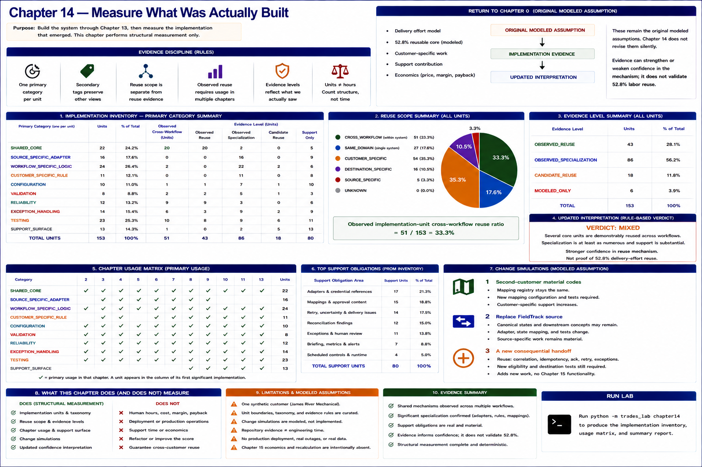

# Chapter 14 — Measure What Was Actually Built



The reuse hypothesis must face the implementation that emerged, not the architecture we
wished for. This chapter creates a deterministic, curated inventory of repository structures
implemented through Chapter 13. It performs **structural measurement only**; Chapter 15 and
economic recalculation remain deliberately absent.

```text
ORIGINAL REUSE ASSUMPTION
          ↓
   BUILD THE SYSTEM
          ↓
IMPLEMENTATION INVENTORY
          ↓
 ┌────────┼─────────┐
 ↓        ↓         ↓
REUSED  SPECIALIZED SUPPORT
 ↓        ↓         ↓
        EVIDENCE
          ↓
UPDATED CONFIDENCE

IMPLEMENTATION UNITS ≠ ENGINEERING HOURS
```

## Return to Chapter 0

Chapter 0 modeled delivery effort, a **52.8% reusable core**, customer-specific work,
support contribution, and economics. Those remain the original **MODELED ASSUMPTION**;
Chapter 14 does not revise them silently:

```text
ORIGINAL MODELED ASSUMPTION
        ↓
IMPLEMENTATION EVIDENCE
        ↓
UPDATED INTERPRETATION
```

The new evidence is modules, models, fixtures, adapters, mappings, tests, reliability
mechanisms, and operational controls. An *implementation unit* is a synthetic textbook
classification boundary around one meaningful structure—not every function. Human delivery
time was not observed.

## Classification and evidence discipline

Every unit has exactly one primary category: `SHARED_CORE`,
`SOURCE_SPECIFIC_ADAPTER`, `WORKFLOW_SPECIFIC_LOGIC`, `CUSTOMER_SPECIFIC_RULE`,
`CONFIGURATION`, `VALIDATION`, `RELIABILITY`, `EXCEPTION_HANDLING`, `TESTING`, or
`SUPPORT_SURFACE`. Secondary tags preserve other dimensions without double-counting the
primary summary.

Reuse scope is separate: `CROSS_WORKFLOW`, `SAME_DOMAIN`, `CUSTOMER_SPECIFIC`,
`DESTINATION_SPECIFIC`, `SOURCE_SPECIFIC`, or `UNKNOWN`. Thus an internal shared mechanism
need not be proven reusable for another customer. Evidence levels distinguish
`OBSERVED_REUSE`, `OBSERVED_SPECIALIZATION`, `CANDIDATE_REUSE`, and `MODELED_ONLY`.
An observed cross-workflow unit must have usage evidence in multiple chapters.

Run:

```bash
python -m trades_lab chapter14
```

The command prints primary, evidence-level, reuse-scope, and support counts plus a Chapter
2–13 usage matrix. The machine-readable `ImplementationEvidenceReport` exposes the same
deterministic values to tests.

## What the inventory found

Identity, provenance, correlation, exception records, idempotency, acknowledgements, retry,
replay, and exception ownership recur across implemented handoffs. This is **OBSERVED LAB
RESULT** evidence for a real structural reuse mechanism. Runtime health covers several
capabilities, although one fictional customer limits cross-customer claims.

Specialization is equally real. EstimateWorks, CrewBoard, SupplyDesk, FieldTrack, LedgerPro,
and the job boundary retain source/destination semantics. Eligibility, field progression,
material normalization, and billing gates remain workflow/domain-specific. James River
Mechanical mappings, approval, routing, thresholds, schedules, credentials, and capability
configuration do not become reusable merely because the repository stores them cleanly.

### Negative evidence

The inventory does not hide unfavorable structure. Uncertain-outcome lookup depends on each
destination's capabilities and failure meanings. Reconciliation includes one-off relationship
expectations rather than a wholly generic engine. These facts increase adapter, validation,
testing, and support work. No refactor was performed to improve the score.

## Support surface

Support obligations are independently tagged and summarized: adapters and credential
references; mapping and approval content; retry exhaustion and uncertainty; reconciliation;
exception routing; briefing rules; metrics and alerts; scheduled controls; and runbooks.
Reusable software can therefore create recurring support work. This is a structural inventory,
not support hours or support economics.

## Change simulations

These experiments are explicit **MODELED ASSUMPTION**, informed by observed boundaries:

1. **Second-customer material codes:** `MaterialMappingRegistry` stays unchanged, while new
   mapping configuration and tests are required and customer-specific support grows. No full
   second customer is implemented.
2. **Replace FieldTrack:** canonical state and downstream readiness concepts may remain, but
   the adapter, source-state mapping, and tests change. Source-specific work remains material.
3. **A new consequential handoff:** existing workflows demonstrate reuse of correlation,
   idempotency, acknowledgement, and bounded retry. New eligibility and destination tests are
   still necessary; this adds no Chapter 15 functionality.

## Why LOC is not the verdict

Raw lines are a poor primary measure: generated or boilerplate code can be large; difficult
logic can be short; tests and documentation create value; configuration can carry substantial
customer burden; and deletion or refactoring can improve a system while reducing LOC. Files,
commits, tests, tokens, and units likewise are not converted into time.

The report's **Observed implementation-unit cross-workflow reuse ratio** divides observed,
cross-workflow units by all curated units. The Chapter 0 value instead describes the modeled
share of *delivery effort*. The denominators and weighting are different. Repository evidence
can strengthen or weaken confidence in the mechanism, but cannot validate 52.8% labor reuse.

## Updated interpretation and limitations

The rule-based verdict is **MIXED**: several core units are demonstrably used by multiple
workflows, while observed specialization is at least as numerous and support is substantial.
Unit boundaries, taxonomy, confidence thresholds, support interpretation, chapter usage, and
change scenarios are curated modeling choices. Only one synthetic customer and no production
deployment exist. There are no observed human hours, dollars, margins, payback, or recurring
support economics. Those questions remain outside Chapter 14.
