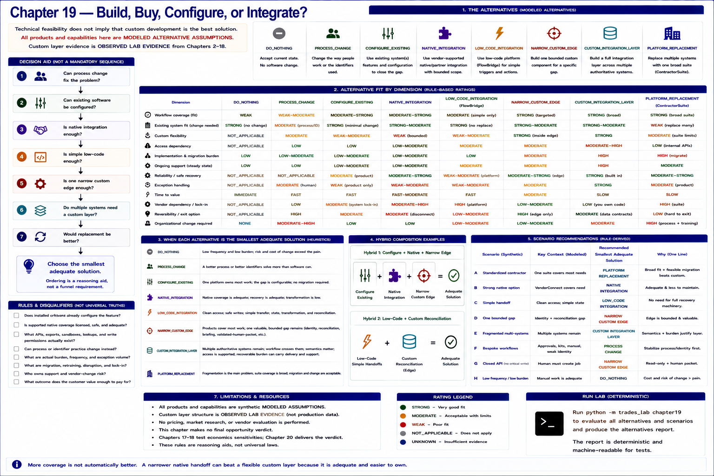

# Chapter 19 — Build, Buy, Configure, or Integrate?



Technical feasibility does not imply that custom development is the best solution. The business
problem is compared with eight bounded strategies: `DO_NOTHING`, `PROCESS_CHANGE`,
`CONFIGURE_EXISTING`, `NATIVE_INTEGRATION`, `LOW_CODE_INTEGRATION`, `NARROW_CUSTOM_EDGE`,
`CUSTOM_INTEGRATION_LAYER`, and `PLATFORM_REPLACEMENT`. This is not custom software versus nothing.

```text
BUSINESS PROBLEM
      ↓
CAN PROCESS CHANGE FIX IT?
      ↓
CAN EXISTING SOFTWARE BE CONFIGURED?
      ↓
IS NATIVE INTEGRATION ENOUGH?
      ↓
IS SIMPLE LOW-CODE ENOUGH?
      ↓
IS ONE NARROW CUSTOM EDGE ENOUGH?
      ↓
DO MULTIPLE SYSTEMS NEED A CUSTOM LAYER?
      ↓
WOULD REPLACEMENT BE BETTER?
      ↓
CHOOSE THE SMALLEST ADEQUATE SOLUTION
```

This ordering is a reasoning aid, not a mandatory sequential funnel. Disqualifiers are checked
before fit, and credible options can be considered together.

## Alternatives and evidence discipline

All named products here are fictional. **ContractorSuite** is modeled as a broad operations suite;
**VendorConnect** as a vendor-supported but bounded native handoff; and **FlowBridge** as a low-code
trigger/action platform with modest transformations. Every capability is a
`MODELED ALTERNATIVE ASSUMPTION`, not a product fact. No real vendor was researched or evaluated.

The custom layer differs: its identity, idempotency, recovery, reconciliation, exception, variation,
access, delivery, and support surfaces are `OBSERVED_LAB_EVIDENCE` from Chapters 2–18. That evidence
shows structure and synthetic behavior—not production efficacy, vendor access, labor hours, or market
demand. Chapter 19 introduces no pricing or other `SENSITIVITY_ASSUMPTION`.

## Dimensions and transparent rules

Each alternative is rated `STRONG`, `MODERATE`, `WEAK`, `NOT_APPLICABLE`, or `UNKNOWN` across workflow
coverage, existing-system fit, custom flexibility, access dependency, implementation and migration
burden, ongoing support, reliability/recovery, exception handling, time-to-value, vendor dependency,
reversibility, and organizational change. There is no total score or hidden weighting.

- **Configure** when one current platform owns most work, the gap is configurable, migration is
  unnecessary, and differentiation is weak.
- **Native** when its bounded coverage is adequate, recovery is adequate, and transformation is low.
- **Low-code** when writes are safe and the transfer, state, transformation, and reconciliation are simple.
- **Narrow custom edge** when products cover most work but one valuable, bounded identity,
  reconciliation, briefing, validated-human-packet, or cross-system gap remains.
- **Full custom layer** when several authoritative systems must remain, workflow crosses them, semantics
  matter, access is supported, native coverage is incomplete, and recoverable burden can plausibly carry
  delivery and support.
- **Replace** when fragmentation is the main problem, modeled suite coverage is broad, and migration and
  change are acceptable.
- **Do nothing or change process** when frequency and recoverable burden are low, access is poor, or a
  human procedure is adequate.

These are modeled decision principles, not universal truths. More coverage is not automatically better:
a narrower native handoff can beat a flexible custom layer because it is adequate and easier to own.

## Burdens and disqualifiers

Replacement can remove integrations but adds migration, retraining, process change, implementation risk,
temporary disruption, and vendor dependency. Those costs are neither ignored nor exaggerated. Custom
software is also not a one-time build: Chapter 17 exposes discovery, adapters, mappings, reliability,
testing, access, and production delivery work; Chapter 18 exposes credentials, mappings, reconciliation,
exception review, vendor changes, alerts/runbooks, and customer-rule maintenance.

An unsupported critical consequential write disqualifies full custom automation. A native option is
disqualified if it misses the required workflow. Under the synthetic FlowBridge assumptions, inability to
provide required safe recovery disqualifies low-code. A replacement is disqualified when an essential
unusual workflow is unsupported and cannot be configured. A disqualified option cannot win elsewhere.

## Hybrids and scenario results

Build-versus-buy is not binary. Two credible compositions are
`CONFIGURE_EXISTING + NATIVE_INTEGRATION + NARROW_CUSTOM_EDGE`, and low-code simple handoffs plus custom
reconciliation. A narrow edge makes identity normalization, reconciliation, operational briefing, a
validated human handoff, or one unsupported workflow first-class rather than forcing replacement or a
full layer.

| Scenario | Rule-derived recommendation | Why |
|---|---|---|
| A — standardized | `PLATFORM_REPLACEMENT` | Broad modeled suite fit and feasible migration beat technically feasible custom. |
| B — strong native | `NATIVE_INTEGRATION` | The important handoff is covered with less maintenance. |
| C — simple handoff | `LOW_CODE_INTEGRATION` | Clean access and simple state do not require full recovery machinery. |
| D — one gap | `NARROW_CUSTOM_EDGE` | Identity and reconciliation remain bounded. |
| E — fragmented | `CUSTOM_INTEGRATION_LAYER` | Multiple systems remain, semantics matter, access works, and burden is meaningful. |
| F — bespoke | `PROCESS_CHANGE` | Stabilize weak identity and completion before automating unsupported variation. |
| G — closed write | `NARROW_CUSTOM_EDGE` | Full automation is disqualified; a read-only validated human packet remains. |
| H — low burden | `DO_NOTHING` | Adequate manual work costs less organizationally than automation. |

Thus custom loses even when technically feasible in A, B, C, D, and H; wins for a defensible structural
reason in E; and is deliberately narrowed in D and G.

## Discovery checklist and limitations

- Does installed software already configure the feature?
- Is supported native coverage licensed, safe, and adequate?
- Which APIs, exports, sandboxes, lookups, and write permissions actually exist?
- Can process or identifier practice change instead?
- What are actual burden, frequency, and exception volume?
- What are migration, retraining, disruption, and lock-in?
- Who owns support and vendor-change risk?
- What outcome does the customer value enough to pay for?

These unresolved questions prevent false certainty. Scenario recommendations apply only inside their
synthetic facts. Chapter 19 gives **no overall opportunity verdict** and does not implement Chapter 20.
