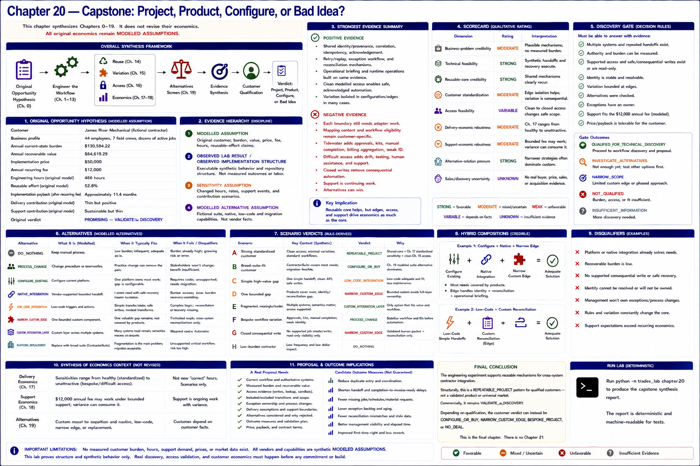

# Chapter 20 — Capstone: Project, Product, Configure, or Bad Idea?



This final chapter synthesizes Chapters 0–19; it does not revise their economics. A technically successful integration is not automatically a product, a good project, or something that should be built.

```text
ORIGINAL OPPORTUNITY HYPOTHESIS
              ↓
      ENGINEER THE WORKFLOW
              ↓
 ┌────────────┼─────────────┐
 ↓            ↓             ↓
REUSE      VARIATION      ACCESS
 ↓            ↓             ↓
DELIVERY   SUPPORT     ALTERNATIVES
 └────────────┼─────────────┘
              ↓
        EVIDENCE SYNTHESIS
              ↓
     CUSTOMER QUALIFICATION
              ↓
 ┌────────────┼──────────────┐
 ↓            ↓              ↓
CONFIGURE   NARROW         CUSTOM
 / BUY       EDGE          PROJECT
                              ↓
                    PRODUCT ONLY IF
                    EVIDENCE SUPPORTS IT
```

## Original hypothesis

James River Mechanical is the repository's fictional contractor: 44 employees, seven field crews, and dozens of active jobs. The repository does not contain a five-location assumption, so this chapter does not invent one. All original commercial values remain **MODELED ASSUMPTION**: $130,584.22 annual current-state burden, $64,619.29 recoverable value, $50,000 implementation, $12,000 annual recurring, 466 engineering hours, 52.8% reusable effort, approximately 11.4-month implementation payback after the recurring fee, “thin but positive” delivery contribution, “sustainable but thin” support contribution, and **PROMISING — VALIDATE IN DISCOVERY**.

## Experiment and evidence hierarchy

Chapters 1–13 model discovery and then implement identity, provenance, transitions, handoffs, idempotency, acknowledgement, retry/replay, reconciliation, exception ownership, briefing and runtime operations. Chapter 14 inventories structure; Chapter 15 varies the customer; Chapter 16 varies access; Chapters 17–18 test delivery and support sensitivities; Chapter 19 screens alternatives.

The machine-readable report preserves four classes:

1. **MODELED ASSUMPTION** — original customer, burden, value, price, fee, hours and reusable-effort claims.
2. **OBSERVED LAB RESULT / OBSERVED IMPLEMENTATION STRUCTURE** — executable synthetic behavior and repository structure, never measured customer outcomes or labor.
3. **SENSITIVITY ASSUMPTION** — changed hours, rates, support-event frequencies and contribution scenarios.
4. **MODELED ALTERNATIVE ASSUMPTION** — fictional suite, native, low-code and migration capabilities.

## Strongest evidence

**Positive.** Canonical identity/provenance, correlation, idempotency, acknowledgement, retry/replay, exception, reconciliation and runtime mechanisms recur. Management visibility derives from the same evidence. Clean modeled access permits safe acknowledged automation, and some variation remains at configuration/edge layers.

**Negative.** Each boundary still needs adapter work; mapping content and workflow eligibility remain specific. Tidewater introduces approvals, kits, manual completion, billing aggregation and weak identity. Difficult access adds drift, testing, human assistance and support; closed writes remove consequential automation. Support is continuing work. Alternatives can win. Repository reuse neither validates 52.8% labor reuse nor the original commercial model.

## Scorecard

| Dimension | Rating | Interpretation |
|---|---|---|
| Business-problem credibility | MODERATE | Plausible mechanisms; no measured burden. |
| Technical feasibility | STRONG | Synthetic handoffs and recovery execute. |
| Reusable-core credibility | STRONG | Shared identity, reliability, exceptions and runtime recur. |
| Customer standardization | MODERATE | Edge isolation helps; variation is consequential. |
| Access feasibility | VARIABLE | Clean through closed access changes safe scope. |
| Delivery-economic robustness | MODERATE | Chapter 17 ranges from healthy to unattractive. |
| Support-economic robustness | MODERATE | Bounded support may fit; variance may consume the fee. |
| Alternative-solution pressure | STRONG | Narrower strategies can dominate custom work. |
| Sales/discovery uncertainty | UNKNOWN | No real buyer, price, sales or acquisition evidence. |

There is no numeric total.

## Product versus repeatable project

**REUSABLE SOFTWARE COMPONENTS ≠ PRODUCT.** The lab did not establish a standardized buyer, workflow, integrations, onboarding, pricing, support model or sales motion. It therefore did not demonstrate a product or justify `PRODUCT_CANDIDATE`.

The structural class is **REPEATABLE_PROJECT**: a common workflow and meaningful shared core exist, but adapters, configuration, customer testing and onboarding remain. That class is only credible when discovery bounds specialized work, validates access before sale, bounds support contractually, and screens alternatives early.

Current commercial readiness is separately **VALIDATE_IN_DISCOVERY**, because actual customer economics and vendor access are unknown.

## Qualification profile and disqualifiers

An ideal candidate must retain multiple systems, has repeated handoffs and enough volume, can measure meaningful burden, has supported access and stable/resolvable identity, lacks adequate native coverage, keeps variation mainly at edges, owns exceptions/process changes, and can support delivery plus bounded recurring support.

Disqualify or narrow a prospect when a platform/native integration already solves most needs; volume or recoverable burden is low; consequential writes are closed; identity cannot be resolved; management will not own process/exceptions; rules repeatedly change the core; or support expectations exceed recurring economics.

## Scenario verdicts

| Scenario | Verdict | Trace |
|---|---|---|
| Strong standardized customer | REPEATABLE_PROJECT | Shared core + Chapter 17 standardized sensitivity + clean Chapter 16 access. |
| Broad-suite-fit customer | CONFIGURE_OR_BUY | Chapter 19 modeled suite alternative dominates. |
| Simple high-value gap | NARROW_CUSTOM_EDGE | A bounded edge avoids full-layer ownership. |
| James River Mechanical baseline | VALIDATE_IN_DISCOVERY | Chapter 0 economics and access remain modeled. |
| Tidewater Specialty Services | BESPOKE_PROJECT | Chapter 15 specialization; Chapters 17–18 downside. |
| Difficult access | VALIDATE_IN_DISCOVERY | Chapter 16 changes scope; Chapter 17 requires redesign. |
| Closed consequential write | NARROW_CUSTOM_EDGE | Human/read-only packet only; no positive full-custom verdict. |
| Low-burden contractor | NO_DEAL | Burden cannot support the custom surface. |

## Discovery gate

The deterministic gate asks whether multiple systems and repeated handoffs exist; authority and burden can be measured; access and consequential writes are safe/reconcilable; identity is stable; variation is bounded; alternatives were checked; exceptions have an owner; support fits; and price/payback is tolerable. It returns `QUALIFIED_FOR_TECHNICAL_DISCOVERY`, `INVESTIGATE_ALTERNATIVES`, `NARROW_SCOPE`, `NOT_QUALIFIED`, or `INSUFFICIENT_INFORMATION`. Synthetic answers are not prospect validation.

The sales motion should be: **integration discovery → workflow/authority map → access validation → alternative screen → economic qualification → only then a custom proposal**.

## Economics and alternatives

Chapter 17 supplies no new “correct” hours. Its sensitivities say standardized delivery can be healthy; baseline/mixed can be thin; bespoke can be unattractive; difficult/closed access requires redesign. Chapter 18 says $12,000 may work under bounded support, while access, mapping, exceptions and bespoke rules can consume it. Those are sensitivities, not observations.

Chapter 19 requires custom integration to survive screening against process change, configuration, native integration, low-code, narrow custom and replacement. Its vendor capabilities are fictional; real coverage remains discovery evidence.

## Proposal and outcome implications

A real proposal needs the current workflow, authoritative systems, measured burden, included/excluded transitions, access evidence, exception ownership, delivery assumptions, support boundaries, alternatives, outcome measures, risks, price and validation plan.

Candidate measures—not lab achievements—include reduced duplicate entry and coordination, shorter handoff and completion-to-invoice-readiness delays, fewer missing jobs/schedules/material requests, lower exception backlog, and fewer reconciliation mismatches.

## Critical unknowns and limitations

The executable lab cannot answer actual burden, recoverable value, willingness to pay, implementation hours, support demand, API access, native coverage, sales-cycle length, acquisition difficulty, or frequency of bespoke variation. It uses synthetic systems and customers, creates no real-vendor capability claim, and measures no real operational improvement.

## Final conclusion

The engineering experiment supports reusable mechanisms for cross-system contractor integration. Structurally, this is a **REPEATABLE_PROJECT** pattern for qualified customers—not a validated product or universal market. Commercially, it remains **VALIDATE_IN_DISCOVERY**. Depending on qualification, the customer verdict can instead be `CONFIGURE_OR_BUY`, `NARROW_CUSTOM_EDGE`, `BESPOKE_PROJECT`, or `NO_DEAL`. This is the final chapter; there is no Chapter 21.
